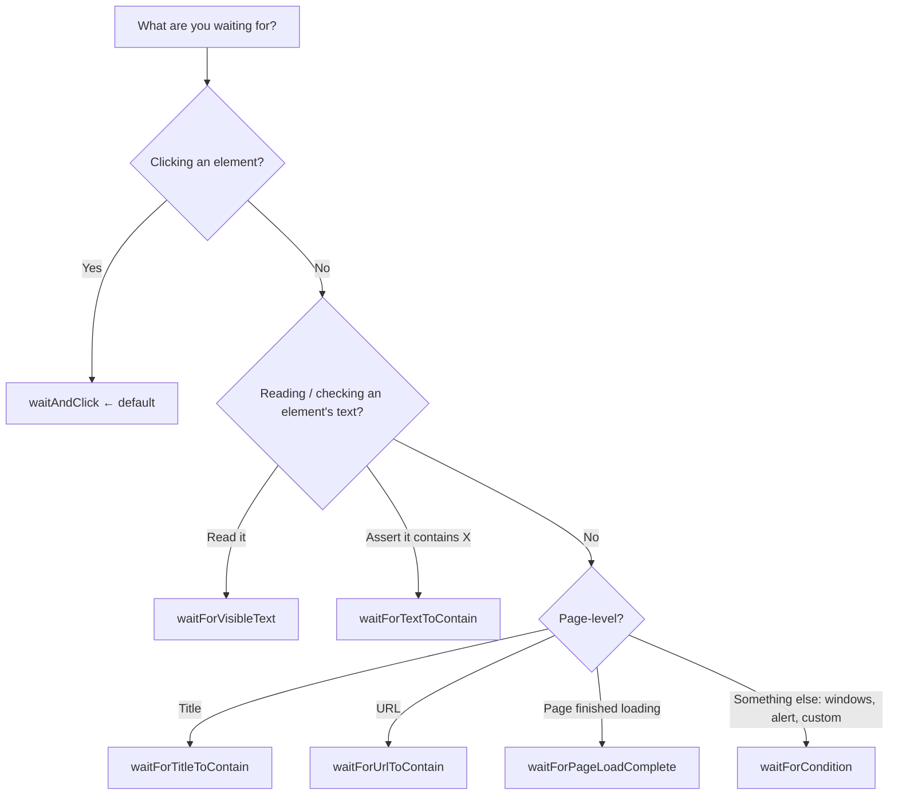

# WaitUtil Guide

> **Audience:** everyone writing or reviewing Java + Cucumber + Selenium tests, from first-week beginners to advanced automation developers.
> **Purpose:** explain *why* `WaitUtil` exists, *when* to use each method, and *how* to use it, with copy-paste snippets.
> **Golden rule:** **`Thread.sleep()` is not allowed in test code. Use `WaitUtil`.**

---

## Table of contents

1. [What is WaitUtil?](#1-what-is-waitutil)
2. [Why it exists: the problem with `Thread.sleep()`](#2-why-it-exists-the-problem-with-threadsleep)
3. [Why one centralised class matters](#3-why-one-centralised-class-matters)
4. [Quick start (2 minutes)](#4-quick-start-2-minutes)
5. [Which method do I use? (decision guide)](#5-which-method-do-i-use-decision-guide)
6. [Method reference with code snippets](#6-method-reference-with-code-snippets)
7. [How to use it in Cucumber + Page Objects](#7-how-to-use-it-in-cucumber--page-objects)
8. [Refactoring recipes: replacing `Thread.sleep()`](#8-refactoring-recipes-replacing-threadsleep)
9. [Behaviour contract: what it returns, what it throws](#9-behaviour-contract-what-it-returns-what-it-throws)
10. [Under the hood (for advanced developers)](#10-under-the-hood-for-advanced-developers)
11. [Do's and Don'ts](#11-dos-and-donts)
12. [Troubleshooting / FAQ](#12-troubleshooting--faq)
13. [Cheat sheet](#13-cheat-sheet)
14. [Migration and code-review checklist](#14-migration-and-code-review-checklist)

---

## 1. What is WaitUtil?

`WaitUtil` is a **static, centralised helper class** that gives every test in the framework one consistent, reliable way to:

- **Click** elements safely (`waitAndClick`, `safeClick`)
- **Read / verify text** once it appears (`waitForVisibleText`, `waitForTextToContain`)
- **Verify navigation** (`waitForTitleToContain`, `waitForUrlToContain`, `waitForPageLoadComplete`)
- **Wait for anything else** at driver level (`waitForCondition`), e.g. window count, alert present

It was introduced to **refactor and remove `Thread.sleep()`** calls scattered across the codebase.

| Property | Value |
|---|---|
| Type | `public final` utility class, private constructor, static methods only (never `new WaitUtil()`) |
| Default max wait | **30 seconds** per call |
| Polling interval | **~1 second** |
| Retries automatically through | `NoSuchElementException`, `StaleElementReferenceException` |
| Failure style | Returns `false` / `Optional.empty()` (does not throw for normal timing problems) |
| Logging | Built in: prints element diagnostics on failure and click duration |

---

## 2. Why it exists: the problem with `Thread.sleep()`

```java
Navigation.navigateToURL(startPageURL);
Thread.sleep(5000);                      // "should be enough..."
driver.findElement(By.id("submit")).click();
```

A fixed sleep is a **guess**, and it is wrong in both directions:

| Situation | What `Thread.sleep(5000)` does | Result |
|---|---|---|
| Page is ready in 400 ms | Still waits the full 5 s | **Wasted time**, multiplied across hundreds of scenarios |
| Page is slow today (CI under load) and takes 6 s | Stops waiting after 5 s | **Flaky failure**, "works on my machine" |
| Environment gets slower over months | Nobody remembers why the sleep is 5 s | **Silent rot**, more and more sleeps get added |

**A condition-based wait fixes both problems.** It polls the *actual* condition ("is the button enabled?", "does the title contain Dashboard?") and continues **the moment** it is true, while still tolerating a slow page up to the timeout.

```
Thread.sleep(5000)   ──►  ALWAYS 5.0 s     (too long when fast, too short when slow)
WaitUtil.waitFor...  ──►  0.4 s when fast, up to 30 s when slow, and it can tell you which condition failed
```

Other problems with sleeps that `WaitUtil` avoids:

- **Unreadable intent:** `sleep(2000)` doesn't say *what* you are waiting for. `waitForUrlToContain(driver, "/dashboard")` does.
- **Hidden failures:** after a sleep, a test may click a not-yet-ready element and fail with a confusing error far from the real cause.
- **Slow pipelines:** 300 sleeps × 2 s = **10 minutes** of pure idle time per run.

---

## 3. Why one centralised class matters

Every team eventually writes wait logic inline, and each person does it slightly differently. Centralising it in `WaitUtil` gives us:

| Benefit | What it means in practice |
|---|---|
| **One polling policy** | Timeout and poll interval live in one place (`WAIT_TIME`, `POLL_INTERVAL`). Tuning for CI is a one-line change, not a 200-file hunt. |
| **Consistent flake handling** | Stale elements and not-yet-present elements are retried the same way everywhere, so nobody re-invents (or forgets) `ignoring(StaleElementReferenceException.class)`. |
| **Consistent failure contract** | Every method returns a `boolean` / `Optional`. You can assert on the result without try/catch clutter. |
| **Smart click fallbacks** | Native click first, then stale-retry, then JavaScript fallback, all handled for you. Individual tests don't need `JavascriptExecutor` code. |
| **Built-in diagnostics** | On failure, it logs displayed/enabled state, location, tag, text, opacity and the exception. This is priceless when debugging a red CI run. |
| **Timing metrics** | `waitAndClick` logs how long each click took. Slow spots become visible. |
| **Reviewable standard** | Reviewers have one rule: "no `Thread.sleep`, use `WaitUtil`." Easy to enforce (see [checklist](#14-migration-and-code-review-checklist)). |
| **Onboarding** | Beginners get a safe default; advanced users get an escape hatch (`waitForCondition`). |

---

## 4. Quick start (2 minutes)

The class has no instances. Call the static methods, passing the `WebDriver` and (where relevant) the `WebElement`:

```java
import org.openqa.selenium.WebDriver;
import org.openqa.selenium.WebElement;
// import WaitUtil from wherever it lives in your project

WebDriver driver = BrowserDriver.getCurrentDriver();

// Click a button once it's ready
boolean clicked = WaitUtil.waitAndClick(driver, submitButton);

// Wait for a message and read it
Optional<String> banner = WaitUtil.waitForVisibleText(driver, successBanner);

// Wait for navigation to finish
WaitUtil.waitForUrlToContain(driver, "/dashboard");
```

Because methods **return results instead of throwing**, always **assert on the return value** so a failed wait fails the test with a clear message:

```java
assertThat(WaitUtil.waitAndClick(driver, submitButton))
        .as("Submit button should be clickable")
        .isTrue();
```

---

## 5. Which method do I use? (decision guide)



**Rule of thumb**

| I want to… | Use |
|---|---|
| Click *anything* (button, link, checkbox, radio, custom `role="button"`) | `waitAndClick` ← **default** |
| Click and I only care that it's enabled (rare) | `safeClick` |
| Get the text of a banner / toast / label | `waitForVisibleText` |
| Assert a banner / toast eventually shows a message | `waitForTextToContain` |
| Confirm I landed on the right page (title) | `waitForTitleToContain` |
| Confirm I landed on the right page (URL) | `waitForUrlToContain` |
| Replace a `sleep()` after `navigate()` / `get()` | `waitForPageLoadComplete` |
| Wait for a 2nd browser tab, an alert, or any custom condition | `waitForCondition` |

---

## 6. Method reference with code snippets

> All examples assume `driver` is your `WebDriver` and elements are `WebElement`s (typically Page Object fields).

### 6.1 `waitAndClick(driver, element)`: default click

```java
public static boolean waitAndClick(WebDriver driver, WebElement element)
```

**Use for:** every click. Buttons, inputs, checkboxes/radios, anchors, and custom non-form clickables (`<div>`, `<span>`, `role="button"`).

**What it does, in order:**

1. **Waits until the element is genuinely ready:** `isEnabled()`, **not** `aria-disabled="true"`, **not** CSS `pointer-events: none`.
2. Performs a **real native click**.
3. If the click goes **stale** → retries via `safeClick`.
4. If the click is **intercepted / not interactable** (overlay, opacity-0 tricks) → falls back to a **JavaScript click** (with a temporary opacity override, always restored afterwards).
5. Logs how long it took.

**Returns:** `true` if clicked by any strategy; `false` if never ready or every strategy failed.
**Throws:** `ElementNotFoundException` if the element was *never present* for the whole wait (usually a wrong locator).

```java
// Basic
assertThat(WaitUtil.waitAndClick(driver, loginButton)).isTrue();

// Checkboxes/radios with custom styling (e.g. GOV.UK Design System keeps the real
// <input> visually hidden). waitAndClick deliberately does NOT require isDisplayed(),
// so this works:
assertThat(WaitUtil.waitAndClick(driver, agreeToTermsCheckbox)).isTrue();
```

> **Why doesn't it require `isDisplayed()`?** Many accessible components hide the real `<input>` (opacity 0 / off-screen) and show a styled label instead. Waiting for "displayed" would hang forever on those, even though they are perfectly clickable.

---

### 6.2 `safeClick(driver, element)`: plain click, waits for enabled

```java
public static boolean safeClick(WebDriver driver, WebElement element)
```

**Use for:** rare cases where you want a plain native click that only requires `isEnabled()`, with no JS fallback. `waitAndClick` uses it internally as its stale-element retry. **When unsure, use `waitAndClick`.**

```java
WaitUtil.safeClick(driver, nextButton);
```

**Returns:** `true` if clicked, `false` on timeout/error. **Throws:** `ElementNotFoundException` if never present.

---

### 6.3 `waitForVisibleText(driver, element)`: wait then read text

```java
public static Optional<String> waitForVisibleText(WebDriver driver, WebElement element)
```

**Use for:** read-only elements (banners, toasts, labels, confirmation numbers) that show up asynchronously. Waits until the element is **visible** and its text is **non-blank**, then returns the **trimmed** text.

```java
Optional<String> reference = WaitUtil.waitForVisibleText(driver, confirmationReference);

assertThat(reference).as("Confirmation reference should be displayed").isPresent();
String value = reference.get();
```

Or in one line, when you just need the value or a failure:

```java
String value = WaitUtil.waitForVisibleText(driver, confirmationReference)
        .orElseThrow(() -> new AssertionError("Confirmation reference never appeared"));
```

**Returns:** `Optional.empty()` if never visible, text stayed blank, or an error occurred.

---

### 6.4 `waitForTextToContain(driver, element, expectedText)`: assert text eventually appears

```java
public static boolean waitForTextToContain(WebDriver driver, WebElement element, String expectedText)
```

**Use for:** asserting that a banner/toast eventually shows the message you expect. **Case-insensitive**, "contains" match, ignores surrounding whitespace.

```java
assertThat(WaitUtil.waitForTextToContain(driver, statusBanner, "payment successful"))
        .as("Status banner should confirm payment")
        .isTrue();
```

---

### 6.5 `waitForTitleToContain(driver, expectedTitle)`: page title

```java
public static boolean waitForTitleToContain(WebDriver driver, String expectedTitle)
```

**Use for:** confirming the right page loaded after navigation or redirect. **Case-insensitive.**

```java
@Then("the dashboard page eventually loads")
public void dashboardPageEventuallyLoads() {
    assertThat(WaitUtil.waitForTitleToContain(driver, "Dashboard")).isTrue();
}
```

---

### 6.6 `waitForUrlToContain(driver, expectedFragment)`: URL

```java
public static boolean waitForUrlToContain(WebDriver driver, String expectedFragment)
```

**Use for:** client-side route changes and redirect chains. **Case-sensitive** (URLs are case-sensitive by spec).

```java
WaitUtil.waitAndClick(driver, continueButton);
assertThat(WaitUtil.waitForUrlToContain(driver, "/payment/confirm"))
        .as("Should be redirected to the confirmation page")
        .isTrue();
```

---

### 6.7 `waitForPageLoadComplete(driver)`: replaces `sleep()` after navigation

```java
public static boolean waitForPageLoadComplete(WebDriver driver)
```

**Use for:** replacing the classic "sleep after navigate". Polls `document.readyState === "complete"`.

```java
// ❌ Before: flaky guess at how long navigation takes
Navigation.navigateToURL(startPageURL);
sleep(500);
BrowserDriver.getCurrentDriver().manage().deleteAllCookies();

// ✅ After: polls the actual condition
Navigation.navigateToURL(startPageURL);
WaitUtil.waitForPageLoadComplete(driver);
BrowserDriver.getCurrentDriver().manage().deleteAllCookies();
```

> **Note:** `readyState` tells you the *document* is loaded. Single-page apps may still be fetching data afterwards. For that, follow with an element-level wait (`waitForVisibleText`, `waitAndClick`) or a `waitForCondition`.
> If the driver can't execute JavaScript, the method returns `true` rather than blocking forever.

---

### 6.8 `waitForCondition(driver, description, condition)`: your escape hatch

```java
public static boolean waitForCondition(WebDriver driver, String description, Function<WebDriver, Boolean> condition)
```

**Use for:** any **driver-level** condition that isn't tied to a single element: window/tab count, alert present, cookie set, element count, custom JS state, etc. The `description` is printed on timeout so failures are self-explanatory. Keep the condition **cheap and side-effect-free**, because it runs about once a second.

```java
// Wait for a new tab/window to open
boolean opened = WaitUtil.waitForCondition(driver, "2 windows open",
        d -> d.getWindowHandles().size() == 2);
assertThat(opened).isTrue();

// Wait for an alert
boolean alertShown = WaitUtil.waitForCondition(driver, "alert present", d -> {
    try {
        d.switchTo().alert();
        return true;
    } catch (NoAlertPresentException e) {
        return false;
    }
});

// Wait for a list to reach an expected size
boolean tenRows = WaitUtil.waitForCondition(driver, "results table has 10 rows",
        d -> d.findElements(By.cssSelector("table#results tbody tr")).size() == 10);

// Wait for a cookie
boolean cookieSet = WaitUtil.waitForCondition(driver, "session cookie present",
        d -> d.manage().getCookieNamed("SESSION") != null);
```

`waitForTitleToContain`, `waitForUrlToContain` and `waitForPageLoadComplete` are all thin wrappers over this method, so you can build your own the same way.

---

## 7. How to use it in Cucumber + Page Objects

### 7.1 Where the waits belong

| Layer | Put waits here? | Notes |
|---|---|---|
| **Page Object methods** | ✅ **Yes, primarily here** | Actions like `clickSubmit()` should be safe to call without callers knowing about timing. |
| **Step definitions** | ✅ For assertions and orchestration | e.g. `assertThat(WaitUtil.waitForUrlToContain(...)).isTrue()` |
| **Feature files (Gherkin)** | ❌ Never | No "And I wait 5 seconds" steps. Ever. |
| **Hooks (`@Before`/`@After`)** | ✅ Where needed | e.g. `waitForPageLoadComplete` after opening the start page. |

### 7.2 Page Object example

```java
public class PaymentPage {

    private final WebDriver driver;

    @FindBy(id = "card-number")        private WebElement cardNumber;
    @FindBy(id = "pay-now")            private WebElement payNowButton;
    @FindBy(css = ".status-banner")    private WebElement statusBanner;

    public PaymentPage(WebDriver driver) {
        this.driver = driver;
        PageFactory.initElements(driver, this);
    }

    public PaymentPage enterCardNumber(String number) {
        cardNumber.sendKeys(number);
        return this;
    }

    /** Click is timing-safe, so callers never need a sleep. */
    public void submitPayment() {
        boolean clicked = WaitUtil.waitAndClick(driver, payNowButton);
        if (!clicked) {
            throw new AssertionError("'Pay now' button could not be clicked");
        }
    }

    public String getStatusMessage() {
        return WaitUtil.waitForVisibleText(driver, statusBanner)
                .orElseThrow(() -> new AssertionError("Status banner never appeared"));
    }
}
```

### 7.3 Step definitions example

```java
public class PaymentSteps {

    private final WebDriver driver = BrowserDriver.getCurrentDriver();
    private final PaymentPage paymentPage = new PaymentPage(driver);

    @Given("the user opens the payment page")
    public void openPaymentPage() {
        Navigation.navigateToURL(Config.paymentUrl());
        assertThat(WaitUtil.waitForPageLoadComplete(driver)).isTrue();
    }

    @When("the user submits the payment")
    public void submitPayment() {
        paymentPage.submitPayment();
    }

    @Then("the payment confirmation page is displayed")
    public void confirmationDisplayed() {
        assertThat(WaitUtil.waitForUrlToContain(driver, "/payment/confirm"))
                .as("Should land on confirmation page")
                .isTrue();
        assertThat(WaitUtil.waitForTitleToContain(driver, "Payment confirmed")).isTrue();
    }

    @Then("the banner says {string}")
    public void bannerSays(String expected) {
        assertThat(WaitUtil.waitForTextToContain(driver, paymentPage.statusBannerElement(), expected))
                .as("Banner should contain '%s'", expected)
                .isTrue();
    }
}
```

### 7.4 Feature file: no waits visible

```gherkin
Scenario: Successful card payment
  Given the user opens the payment page
  When the user enters valid card details
  And the user submits the payment
  Then the payment confirmation page is displayed
  And the banner says "Payment successful"
```

Timing is an **implementation detail** hidden in the Java layer. The feature file stays readable by the business.

### 7.5 Important: locate elements lazily (Page Factory / `@FindBy`)

`WaitUtil` retries through *stale* and *not found* errors, but it retries **the same `WebElement` reference** you pass in.

| How the element was obtained | Behaviour while waiting |
|---|---|
| `@FindBy` field via `PageFactory.initElements` (lazy proxy) | ✅ **Best.** The locator is re-evaluated on each poll, so elements that appear late or get re-rendered are found automatically. |
| `driver.findElement(...)` called *before* the wait | ⚠️ `findElement` itself throws immediately if the element isn't there yet, and a plain reference that goes stale stays stale (the wait will time out and return `false`). |

If you don't use Page Factory, wrap the lookup in a lazily evaluated method, or use `waitForCondition` with a locator:

```java
boolean ready = WaitUtil.waitForCondition(driver, "banner present",
        d -> !d.findElements(By.cssSelector(".status-banner")).isEmpty());
```

---

## 8. Refactoring recipes: replacing `Thread.sleep()`

Find each sleep and ask: **"What am I actually waiting for?"** Then pick the matching row.

| Old code | What you were really waiting for | Replace with |
|---|---|---|
| `sleep(...)` after `navigate()` / `driver.get()` | Page to finish loading | `WaitUtil.waitForPageLoadComplete(driver)` |
| `sleep(...)` before `click()` | Button to become enabled / stop being covered | `WaitUtil.waitAndClick(driver, button)` |
| `sleep(...)` after a click, before checking the URL | Redirect / route change | `WaitUtil.waitForUrlToContain(driver, "/next")` |
| `sleep(...)` after a click, before checking the title | New page title | `WaitUtil.waitForTitleToContain(driver, "Title")` |
| `sleep(...)` before reading a message/toast | Text to appear | `WaitUtil.waitForVisibleText(driver, el)` |
| `sleep(...)` before asserting text | Text to contain X | `WaitUtil.waitForTextToContain(driver, el, "X")` |
| `sleep(...)` waiting for a popup tab | Window count | `WaitUtil.waitForCondition(driver, "2 windows", d -> d.getWindowHandles().size() == 2)` |
| `sleep(...)` waiting for a spinner to go away | Spinner invisible | `waitForCondition(driver, "spinner gone", d -> d.findElements(By.cssSelector(".spinner")).isEmpty())` |

### Worked example

```java
// ❌ BEFORE: 3 sleeps = 6+ seconds of guaranteed idle time, and still flaky
driver.get(loginUrl);
Thread.sleep(2000);
usernameField.sendKeys("alice");
passwordField.sendKeys("secret");
loginButton.click();
Thread.sleep(3000);
Assert.assertTrue(driver.getCurrentUrl().contains("/home"));
Thread.sleep(1000);
Assert.assertTrue(welcomeBanner.getText().contains("Welcome"));
```

```java
// ✅ AFTER: proceeds as soon as each condition is met, and fails with a clear message
driver.get(loginUrl);
WaitUtil.waitForPageLoadComplete(driver);
usernameField.sendKeys("alice");
passwordField.sendKeys("secret");
assertThat(WaitUtil.waitAndClick(driver, loginButton)).as("Login button clickable").isTrue();
assertThat(WaitUtil.waitForUrlToContain(driver, "/home")).as("Redirected to home").isTrue();
assertThat(WaitUtil.waitForTextToContain(driver, welcomeBanner, "welcome")).as("Welcome banner").isTrue();
```

### Migration steps

1. Search the codebase for `Thread.sleep` and any custom `sleep(` wrappers.
2. For each hit, identify the **real condition** (table above).
3. Replace the sleep with the matching `WaitUtil` call and **assert its result**.
4. Run the scenario several times (and on CI) to confirm it's stable *and* faster.
5. Delete the now-unused `sleep` helper once no callers remain.

---

## 9. Behaviour contract: what it returns, what it throws

Understanding this table is the key to using the class correctly.

| Method | Success | Timeout / failure | Can throw |
|---|---|---|---|
| `waitAndClick` | `true` | `false` | `ElementNotFoundException`, NPE (null args) |
| `safeClick` | `true` | `false` | `ElementNotFoundException`, NPE |
| `waitForVisibleText` | `Optional.of(text)` | `Optional.empty()` | `ElementNotFoundException`, NPE |
| `waitForTextToContain` | `true` | `false` | `ElementNotFoundException`, NPE |
| `waitForTitleToContain` | `true` | `false` | NPE (null args) |
| `waitForUrlToContain` | `true` | `false` | NPE (null args) |
| `waitForPageLoadComplete` | `true` | `false` | NPE (null driver) |
| `waitForCondition` | `true` | `false` | NPE (null args) |

### Three kinds of problem, three kinds of outcome

| Kind of problem | Example | What you get |
|---|---|---|
| **Ordinary timing flakiness** | Element is stale, not yet enabled, not yet visible, click intercepted | Retried automatically. If it never recovers: **`false` / `Optional.empty()`** plus a log line |
| **Likely genuine bug: element never existed** | Wrong locator, wrong page, section removed | **`ElementNotFoundException`** (unchecked). Deliberately *not* swallowed, so a bad locator doesn't hide behind a vague "expected true but was false" |
| **Programming error** | Passing `null` for driver/element/text | `NullPointerException` immediately |

> **Important:** because ordinary failures return `false` instead of throwing, **ignoring the return value silently ignores the failure.** Always assert it (or handle it).

```java
// ❌ Failure is silently ignored, and the test carries on with a click that never happened
WaitUtil.waitAndClick(driver, payButton);

// ✅ Failure is reported at the exact step that caused it
assertThat(WaitUtil.waitAndClick(driver, payButton)).as("Pay button clicked").isTrue();
```

---

## 10. Under the hood (for advanced developers)

### 10.1 Shared wait policy

All element-scoped waits are built by one factory, so the policy lives in exactly one place:

```java
new WebDriverWait(driver, WAIT_TIME)                                   // 30 s budget
        .ignoring(NoSuchElementException.class,
                  StaleElementReferenceException.class)                // keep polling through these
        .pollingEvery(POLL_INTERVAL);                                  // ~1 s, floored at 200 ms
```

The poll interval is `max(WAIT_TIME / 30, 200ms)`. The floor prevents a future change to `WAIT_TIME` from producing a zero interval that hot-loops.

### 10.2 `waitAndClick` strategy ladder

```
wait until ready (enabled ∧ ¬aria-disabled ∧ pointer-events≠none)
        │
        ▼
native element.click() ───── success ─────────────► return true
        │
        ├─ StaleElementReferenceException ─► safeClick() (own polling loop)
        │
        └─ ElementClickIntercepted / ElementNotInteractable
                    │
                    ▼
              jsClick():
                1. arguments[0].click()                       ── success ► true
                2. force opacity:1 → native click → ALWAYS restore original opacity
```

Native click always comes first, so a genuinely blocked click is *detected* rather than silently bypassed. JS is only the fallback.

### 10.3 Why the readiness check is tag-agnostic

Per the WebDriver spec, `isEnabled()` can only be `false` for native form controls (`button`, `input`, `select`, `textarea`, `fieldset`, `optgroup`). For anchors and for `div`/`span`/`role="button"` components it is *always* `true`, even if the UI treats them as disabled. So the readiness check additionally looks at `aria-disabled="true"` and computed `pointer-events: none` on **every** element, so custom component-library buttons that are "disabled" aren't clicked too early.

### 10.4 `ElementNotFoundException` detection

`WebDriverWait.until` wraps whatever kept recurring during polling as the cause of the `TimeoutException`. `WaitUtil` walks that cause chain: if a `NoSuchElementException` is in it, the element was *never located* for the entire wait → `ElementNotFoundException`. Otherwise (stale, disabled, hidden) it's treated as ordinary flakiness.

### 10.5 Diagnostics

On failures the util logs a line such as:

```
[WaitUtil] waitAndClick-not-ready-timeout - Displayed: false, Enabled: true, Location: (0, 0), TagName: button, Text: Pay now, Opacity: 0, Exception: TimeoutException: ...
```

Reading element state during logging is wrapped defensively, so logging itself can never throw and mask the real failure.

### 10.6 Building your own wait

Need something the class doesn't cover? Don't drop back to `Thread.sleep`, and don't hand-roll a `WebDriverWait` in a step definition. Use `waitForCondition`. If several tests need the same condition, add a small named method to `WaitUtil` built on `waitForCondition` (as `waitForUrlToContain` is).

---

## 11. Do's and Don'ts

### ✅ Do

- Use **`waitAndClick`** as the default for every click.
- **Assert the returned value** of every wait.
- Put waits **inside Page Object methods** so tests stay clean.
- Give `waitForCondition` a **meaningful description** ("2 windows open"), since it shows up in failure logs.
- Prefer **lazy `@FindBy` elements** (see [7.5](#75-important-locate-elements-lazily-page-factory--findby)).
- Wait for the **specific thing that proves readiness** (element text, URL, title), not just the page load.

### ❌ Don't

- **Don't use `Thread.sleep()`**, ever, in tests, hooks or page objects.
- Don't add "wait N seconds" Cucumber steps.
- Don't ignore the return value (`WaitUtil.waitAndClick(driver, el);` on its own line hides failures).
- Don't mix **implicit waits** with explicit waits: the combination causes unpredictable timeouts. Keep implicit wait at 0 when using `WaitUtil`.
- Don't put slow or side-effecting code in a `waitForCondition` predicate (it runs repeatedly).
- Don't catch `ElementNotFoundException` just to make a test green. It's telling you the locator or page is wrong.
- Don't call `waitForPageLoadComplete` and assume a single-page app has finished rendering.

---

## 12. Troubleshooting / FAQ

**Q: My step failed with `expected true but was false`. How do I find out why?**
Check the console output for lines starting with `[WaitUtil]`. They show which wait timed out, plus the element's displayed/enabled state, tag, text, opacity and the exception. Add an `.as("...")` description to your assertion so you know which step it was.

**Q: I got `ElementNotFoundException`. Is that a flaky test?**
Usually **no**. It means the element could not be located at all for the full wait. Check the locator, whether you're on the expected page, an iframe (`switchTo().frame(...)`), or a shadow DOM.

**Q: `waitAndClick` returned `false` but the button looks fine.**
It waited 30 s for the element to be *ready* and it never was. Common causes: `aria-disabled="true"` is still set, CSS `pointer-events: none`, the button is disabled until a form field is valid, or the element reference went stale (use lazy `@FindBy` elements).

**Q: Does `waitAndClick` need the element to be visible?**
No. This is deliberate, so custom checkboxes/radios with a visually hidden real `<input>` still work. If the element is truly obscured or invisible, Selenium's native click fails and the JavaScript fallback takes over.

**Q: Isn't the JavaScript fallback "cheating" (clicking things a user couldn't)?**
It only triggers when the native click was blocked (overlay / opacity tricks). If a real user could not click something in your app and you *want* the test to fail, verify visibility explicitly (e.g. with `waitForVisibleText` or a `waitForCondition` on `isDisplayed()`) before clicking.

**Q: 30 seconds is too long/short for my case.**
The timeout is a single constant (`WAIT_TIME`) in the class, deliberately not overridable per call, to keep behaviour uniform. If you genuinely need something different, raise it with the team and adjust centrally rather than adding a private wait in your test.

**Q: The test is now slower than before.**
A wait only takes as long as the condition takes to become true. If it consumes the full 30 s, the condition **never** happened. That's a real failure (or a wrong condition), not slowness. Look at the log output.

**Q: Can I use it with `WebDriver` implementations that don't support JavaScript?**
Yes. `waitForPageLoadComplete` returns `true` immediately, and the JS click fallback returns `false` with a log line.

**Q: Can I run tests in parallel?**
The class is stateless (only constants and static methods), so it is thread-safe as long as each thread passes its own `WebDriver` instance.

---

## 13. Cheat sheet

```java
// CLICK (default for everything)
WaitUtil.waitAndClick(driver, element);                        // → boolean

// READ TEXT
WaitUtil.waitForVisibleText(driver, element);                  // → Optional<String>
WaitUtil.waitForTextToContain(driver, element, "text");        // → boolean (case-insensitive)

// PAGE-LEVEL
WaitUtil.waitForTitleToContain(driver, "Title");               // → boolean (case-insensitive)
WaitUtil.waitForUrlToContain(driver, "/path");                 // → boolean (case-SENSITIVE)
WaitUtil.waitForPageLoadComplete(driver);                      // → boolean (replaces sleep after navigate)

// ANYTHING ELSE
WaitUtil.waitForCondition(driver, "what I'm waiting for",
        d -> /* Boolean expression using d */);                // → boolean

// ALWAYS ASSERT THE RESULT
assertThat(WaitUtil.waitAndClick(driver, element)).as("why this matters").isTrue();
```

| | Timeout | Poll | On timeout |
|---|---|---|---|
| All methods | 30 s | ~1 s | `false` / `Optional.empty()`, except `ElementNotFoundException` when the element never existed |

---

## 14. Migration and code-review checklist

**Author checklist (before raising a PR)**

- [ ] No `Thread.sleep(...)` or custom `sleep(...)` in the changed code
- [ ] Every click uses `WaitUtil.waitAndClick`
- [ ] Every `WaitUtil` return value is asserted or handled
- [ ] Waits live in Page Objects / step definitions, not in feature files
- [ ] `waitForCondition` calls have a descriptive label
- [ ] Elements are lazily located (`@FindBy` / `PageFactory`) where they may appear late or re-render
- [ ] Ran the scenario multiple times locally and on CI, confirming it is stable

**Reviewer checklist**

- [ ] Search the diff for `Thread.sleep`, `sleep(`, `TimeUnit.*.sleep`
- [ ] Search for bare `WaitUtil.waitAndClick(...);` statements with a discarded result
- [ ] Search for new hand-rolled `WebDriverWait` usage. Ask whether `WaitUtil` / `waitForCondition` should be used (or extended) instead
- [ ] Check no implicit wait has been introduced

---

*Questions or missing scenarios? Propose a new method on `WaitUtil` (built on `waitForCondition`) rather than adding one-off waits to individual tests. Centralised means everyone benefits.*
