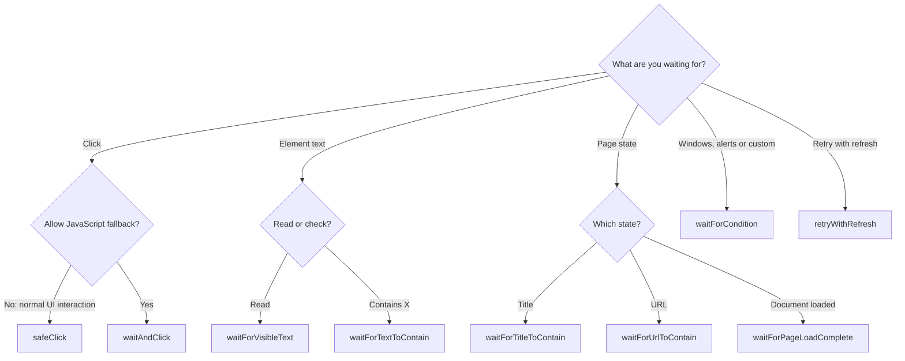

# WaitUtil Quick Reference

Use [`WaitUtil`](sources/WaitUtil.java) for Selenium/browser waits; use [`AwaitUtil`](sources/AwaitUtil-Guide.md) for backend polling.

**Defaults:** 30-second timeout, 500 ms polling. No custom-duration overloads.

## Which method do I use?



**Rule of thumb**

| I want to… | Use |
|---|---|
| Click a button, link, checkbox, radio or custom control using native interaction | `safeClick` — default for UI behaviour checks |
| Click with a JavaScript fallback when native interaction is blocked | `waitAndClick` |
| Read a banner / toast / label | `waitForVisibleText` |
| Wait for text to contain a message | `waitForTextToContain` |
| Confirm the page title / URL | `waitForTitleToContain` / `waitForUrlToContain` |
| Wait for document loading after navigation | `waitForPageLoadComplete` |
| Wait for another tab, an alert or a custom condition | `waitForCondition` |
| Retry a repeatable check after refreshing | `retryWithRefresh` |

Both click helpers check enabled state, `aria-disabled` and `pointer-events`; `safeClick` is not an enabled-only check. For alerts, use `d -> ExpectedConditions.alertIsPresent().apply(d) != null` so an absent alert keeps polling. Assert returned results to make failures fail the test.

## Methods

All methods return `boolean` except `waitForVisibleText`, which returns `Optional<String>`.

| Method | Behaviour |
|---|---|
| `safeClick(driver, element)` | Native click; retries intercepted/not-interactable clicks. Prefer for normal UI interaction. |
| `waitAndClick(driver, element)` | Native click, then JavaScript fallback if intercepted/not interactable. If JS click fails, tries native click with temporary opacity `1`. |
| `waitForVisibleText(driver, element)` | Waits for displayed, non-blank text; returns trimmed text. |
| `waitForTextToContain(driver, element, text)` | Case-insensitive substring match on visible, non-blank text. |
| `waitForCondition(driver, description, condition)` | Polls `Function<WebDriver, Boolean>` until `true`; `false`/`null` keeps waiting. |
| `waitForTitleToContain(driver, text)` | Case-insensitive title substring match. |
| `waitForUrlToContain(driver, fragment)` | Case-sensitive URL substring match. |
| `waitForPageLoadComplete(driver)` | Checks `document.readyState == "complete"`; returns `true` if JavaScript is unsupported. Does not wait for SPA/AJAX rendering. |
| `retryWithRefresh(driver, maxAttempts, action)` | Retries a `BooleanSupplier`; refreshes before each subsequent attempt. |

## Usage

Examples use JUnit Jupiter assertions. **Assert return values when success is required.**

```java
assertTrue(WaitUtil.safeClick(driver, saveButton), "Save click failed");
assertTrue(WaitUtil.waitForUrlToContain(driver, "/dashboard"), "Redirect failed");

String text = WaitUtil.waitForVisibleText(driver, toast)
        .orElseThrow(() -> new AssertionError("Toast text missing"));
assertEquals("Saved successfully", text);

// Re-locate on each poll when the DOM can replace the element.
assertTrue(WaitUtil.waitForCondition(driver, "status complete", d -> {
    WebElement status = d.findElement(By.id("status"));
    return status.isDisplayed()
            && status.getText().trim().equalsIgnoreCase("complete");
}), "Status did not complete");

// Re-locate after refresh; return a boolean and assert outside the action.
assertTrue(WaitUtil.retryWithRefresh(driver, 3, () ->
        WaitUtil.waitForTextToContain(driver,
                driver.findElement(By.id("status")), "complete")),
        "Status did not complete after refresh retries");
```

### Refactoring recipes: replacing `Thread.sleep()`

Find each sleep and ask: **"What am I actually waiting for?"** Then pick the matching row. Assert boolean results and handle empty optionals when success is required.

| Old code | What you were really waiting for | Replace with |
|---|---|---|
| `sleep(...)` after navigation / `driver.get()` | Page to finish loading | `WaitUtil.waitForPageLoadComplete(driver)` |
| `sleep(...)` before `click()` | Button to become enabled / stop being covered | `WaitUtil.waitAndClick(driver, button)` |
| `sleep(...)` after a click, before checking the URL | Redirect / route change | `WaitUtil.waitForUrlToContain(driver, "/next")` |
| `sleep(...)` after a click, before checking the title | New page title | `WaitUtil.waitForTitleToContain(driver, "Title")` |
| `sleep(...)` before reading a message/toast | Text to appear | `WaitUtil.waitForVisibleText(driver, el)` |
| `sleep(...)` before asserting text | Text to contain X | `WaitUtil.waitForTextToContain(driver, el, "X")` |
| `sleep(...)` waiting for a popup tab | Window count | `WaitUtil.waitForCondition(driver, "2 windows", d -> d.getWindowHandles().size() == 2)` |
| `sleep(...)` waiting for a spinner to go away | Spinner hidden or removed | `WaitUtil.waitForCondition(driver, "spinner gone", d -> d.findElements(By.cssSelector(".spinner")).stream().noneMatch(WebElement::isDisplayed))` |

Replace both the sleep and the original click with the click helper. Prefer `safeClick` when an overlay must actually clear; `waitAndClick` can bypass it using JavaScript. Page-load completion does not guarantee SPA/AJAX readiness.

## Failure handling and pitfalls

- Ordinary waits log timeouts/caught errors and return `false` or `Optional.empty()`. Null required arguments throw `NullPointerException`.
- Element waits throw `ElementNotFoundException` only when a timeout's cause chain contains `NoSuchElementException`. This does not prove the element was never present; click readiness checks swallow missing/stale errors, so missing elements can simply yield `false`.
- `waitForCondition` and title/URL/page-load helpers return `false` for polling exceptions; they do not convert missing elements into `ElementNotFoundException`.
- `findElement(...)` before a helper call can throw outside its handling. A stale `WebElement` cannot recover by waiting: re-locate it.
- Click readiness checks enabled state, `aria-disabled` and `pointer-events`, but not visibility. JS clicks can bypass UI obstructions. Assert the resulting state separately; avoid repeated checkbox/radio toggles.
- Diagnostics start with `[WaitUtil]`; `waitAndClick` also logs elapsed time.

## Refresh retry rules

- Allows up to `Math.max(maxAttempts, 2)` attempts, stopping on `true`. First attempt does not refresh.
- After refresh, waits for page load but still runs the action if that wait returns `false`.
- Retries `false`, `ElementNotFoundException`, `TimeoutException`, `StaleElementReferenceException` and `NoSuchElementException`.
- Rethrows `ElementNotFoundException` if thrown on the final attempt; other handled failures end as `false`. Other exceptions/assertion failures propagate.
- Use actions safe to repeat. Each attempt has its own waits; there is no overall 30-second limit.
